```mermaid
architecture-beta
    group docker(cloud)[Docker Container]

    service client(internet)[React Frontend] in docker
    service api(server)[NestJS API] in docker
    service db(database)[PostgreSQL] in docker
    service swagger(docs)[Swagger UI] in docker

    client:T -- B:api
    api:L -- R:db
    api:T -- B:swagger

    group external(cloud)[External Access]

    service browser(person)[User Browser] in external
    service dev(person)[Developer] in external

    browser:R -- L:client
    dev:R -- L:swagger
```

# Diagrama de Arquitectura - Sistema de Gestión de Libros CMPC

## Descripción del Sistema

### 🐳 **Contenedor Docker Principal**

- **Frontend**: React + TypeScript + Ant Design (Puerto 5173)
- **Backend**: NestJS + TypeScript + Sequelize (Puerto 3000)
- **Base de Datos**: PostgreSQL (Puerto 5432)
- **Documentación**: Swagger UI (Puerto 3000/api)

### 🔗 **Conexiones del Sistema**

- **Usuario** → **Frontend React** (Interfaz web)
- **Frontend** → **Backend API** (Llamadas HTTP/REST)
- **Backend** → **Base de Datos** (Sequelize ORM)
- **Desarrollador** → **Swagger UI** (Documentación API)

### 🛡️ **Características de la API**

- **Autenticación JWT**: Sistema de login y tokens
- **Books CRUD**: Gestión completa de libros
- **Authors CRUD**: Gestión de autores
- **Genres CRUD**: Gestión de géneros literarios
- **Editorials CRUD**: Gestión de editoriales
- **CSV Export**: Exportación de datos

### 📊 **Tecnologías Utilizadas**

- **Frontend**: React 18, TypeScript, Ant Design, Redux Toolkit
- **Backend**: NestJS, TypeScript, Sequelize, PostgreSQL
- **Documentación**: Swagger/OpenAPI 3.0
- **Containerización**: Docker Compose
- **Base de Datos**: PostgreSQL con persistencia

### 🌐 **Endpoints Principales**

- `/api/auth` - Autenticación y autorización
- `/api/books` - Gestión de libros
- `/api/authors` - Gestión de autores
- `/api/genres` - Gestión de géneros
- `/api/editorials` - Gestión de editoriales
- `/api` - Documentación Swagger

## Instrucciones de Uso

### 🚀 **Ejecutar el proyecto**

```bash
docker-compose up -d
```

### 🔍 **Acceder a los servicios**

- **Frontend**: http://localhost:5173
- **API**: http://localhost:3000
- **Swagger**: http://localhost:3000/api
